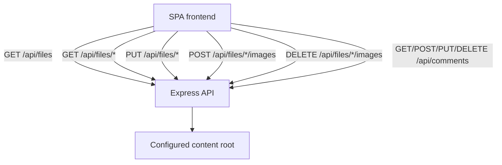
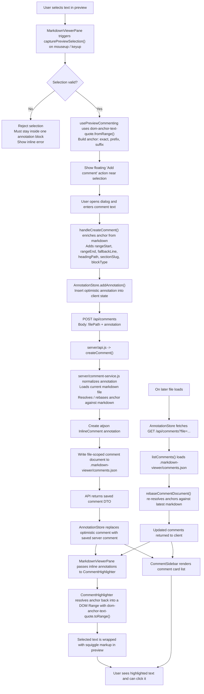

# ssMarkdown Viewer

A browser-rendered markdown reader with a Node/Express API for file discovery, file content, and comment persistence.


erer
## Quick Start

```bash
# Install dependencies
npm install

# Start the dev server (SPA + API)
npm run dev

# Build production assets
npm run build

# Start the production server
npm run start
```

Default port is `3000`.

## Configuration

Set a custom port with `PORT`:

```bash
PORT=8080 npm run start
```

The runtime content root is selected from:

- the current working directory by default
- the first positional CLI argument when using `markdown-viewer ./docs`
- `MARKDOWN_VIEWER_CONTENT_ROOT` when set explicitly

## CLI Usage

```bash
# Build and register the CLI command
npm run build
npm link

# Serve markdown files from the current directory
markdown-viewer

# Serve a different folder
markdown-viewer ./docs

# Custom port
markdown-viewer --port 4000

# Start without opening the browser
markdown-viewer --no-open

# Show help
markdown-viewer --help
```

CLI behavior:

- If the requested port is busy, the CLI picks the next available port.
- Built SPA assets are served from `dist/`.
- Markdown files are read at runtime from the selected content root.

## Architecture

```text
app/
- main.tsx                 SPA bootstrap and browser router
- root.tsx                 app shell and global providers
- routes/
  - _index.tsx             markdown library route
  - $.tsx                  markdown reader route
- lib/api.ts               frontend API client

server/
- api.js                   Express API router
- file-service.js          markdown listing and read logic
- comment-service.js       comment persistence and mutations
- errors.js                normalized API error responses

scripts/
- dev-server.js            Vite middleware dev server + API
- markdown-viewer.js       production/CLI server
```

## API Surface

- `GET /api/files`
- `GET /api/files/*path`
- `PUT /api/files/*path`
- `POST /api/files/*path/images`
- `DELETE /api/files/*path/images?path=./file.png`
- `GET /api/comments?file=...`
- `POST /api/comments`
- `PUT /api/comments/:id`
- `DELETE /api/comments/:id?file=...`

Error responses use a stable JSON shape:

```json
{
  "code": "file_not_found",
  "message": "The requested markdown file was not found."
}
```

## Comments

- Inline and document comments are loaded and saved through the API.
- Existing browser `localStorage` comments are migrated into the server store the first time a file is opened after the upgrade.
- Runtime comment data is stored under `.markdown-viewer/comments.json` inside the selected content root.

### Comment Flow



Inline comment data is anchored twice on purpose: once in the browser when the user selects preview text, and again on the server against raw markdown before persistence. That gives the app enough context to re-find comments after the markdown shifts and to show them both as preview highlights and sidebar entries.

## Editing

- Document edit mode is powered by Lexical and saves markdown back to the original `.md` file on disk.
- The current markdown-safe editor pass supports standard markdown blocks plus block-style markdown images.
- Mermaid fences, markdown tables, raw HTML, and inline image syntax remain read-only until dedicated round-trip handling is added.
- Inserted images are written alongside the current markdown file and saved back as relative markdown image paths.
- Local images are served from the selected content root through `/content/*` so reader and editor previews use the same asset path model.

## Development


```bash
# Typecheck
npm run typecheck

# API integration coverage
npm run test:api

# Production build
npm run build
```

## Usage

1. Place `.md` files in the selected content directory.
2. Start the app.
3. Visit `http://localhost:3000`.
4. Browse the markdown library.
5. Open a file to read it, edit markdown-safe documents, insert images, and add comments.

## License

MIT
